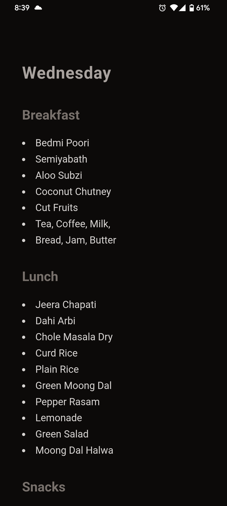

# IIIT-B Menu

**Link**: https://menu.avoggu.com/

**Screenshot**

* Excel file is downloaded via `get-menu.js`
* `process-gemini.js` uploads the downloaded file to Gemini and converts it to JSON
* Eleventy builds a static page from the generated json

https://menu.avoggu.com/#install on mobile for usage info.

#### Forks
* https://github.com/deepanshpandey/iiitb-menu - They also include campus bus timings

#### Thanks
* Thanks [Vidhu Arora](https://github.com/TheRodzz/universal-workout-import) for the idea of using Gemini to process the ever changing Excel format.